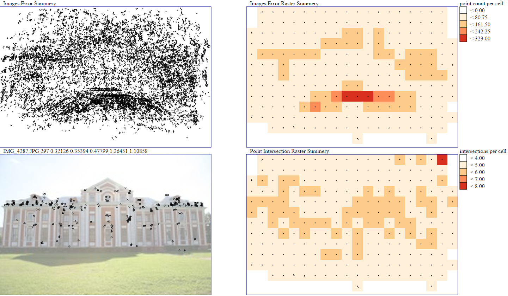
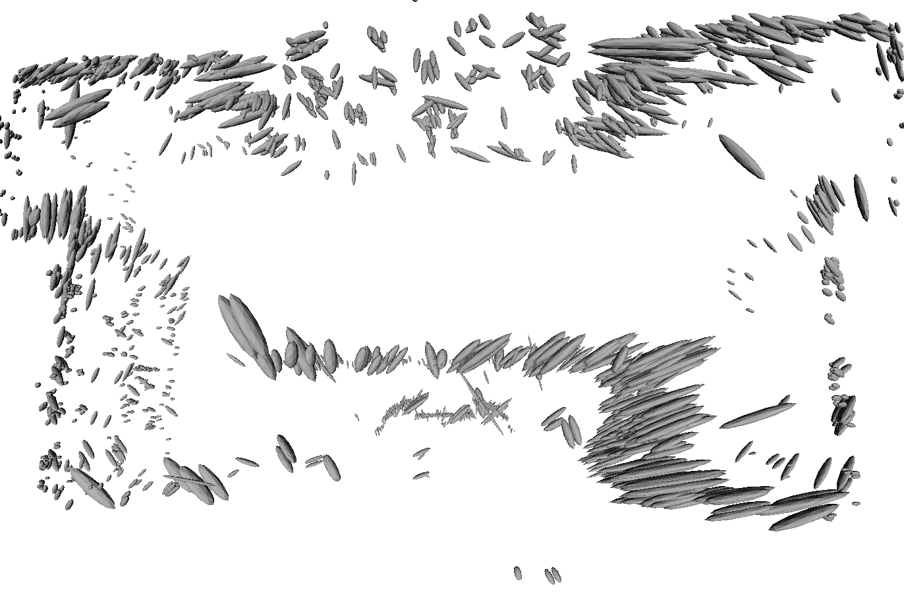

# PhotoScan_Analysis


With PhotoScan_Analysis you can inspect the 
interior accuracy of a Agisoft PhotoScan project.  
It can do three things to help you to improve your results with PhotoScan

- Calculate the standard deviation the reprojection error for each image 
and the Root Mean Square (RMS) over all images. 
- It visualize distribution of feature points over all image 
- calculate and export error ellipsoid in a 3D plot to evaluate the camera 
configuration 

## Report 
```
 Camera Name   Projections  SIGMA x  SIGMA y  SIGMA P    MAX x    MAX y
IMG_4287.JPG           297  0.32126  0.35394  0.47799  1.26451  1.10858
IMG_4288.JPG           231  0.36953  0.39133  0.53823  1.23350  1.23678
.......
IMG_4335.JPG           612  0.19908  0.28742  0.34963  1.08133  1.27099
IMG_4336.JPG           367  0.27735  0.35559  0.45096  1.09968  1.40987

                      RMS:  0.39662  0.52912
``` 

- Projections gives you the count of 3D feature points for the image
- SIGMA x,y (standard deviation of the feature points)
- SIGMA p ( sqrt(SIGMA x^2 + SIGMA y^2) )
- RMS (Root Mean Square of the standard deviation over all images)


Visualization of the image measurements 
*[top left] image measurements (feature point) with error vector over all images  
  [bottom left] image measurements (feature point) with error vector for one image  
  [top right] overview of image measurements in a grid. The center point of a cell
   shows the error vector of all measurements per cell. the color scale indicates
   the number of measurements.  
  [bottom right] same as top right but the color scale indicates the average number of 
  ray intersection per cell.*
 
Error ellipsoids of the object points 
 *Image of error ellipsoids which can be useful for evaluate the camera 
configuration*


## How To
To use the analysis.py script with PhotoScan make sure the the following files
are located in the same folder: 
- sp_exp_for_test.stl
- sphere_aus_mashlab.stl
- STL_Writer.py
- svd.py

To run the analysis.py file in PhotoScan via *Tools->Run Script*. 

You can use the following command line arguments:

```
PhotoScan Analysis v0.4.1

HowTo:
Command Line Arguments:
-report_out [filename]    Creates a report file. Options: filename (default: report)
-svgout [filename]    Creates a SVG-Image with image-measurements Option: filename (default: image_measurements
-svgfactor [factor]       Magnification factor of the error-vector for the SVG-File (default: 40)
-svgcols [columns]    The number of columns used to generate the overview image (default: 20)
-stlout [filename]    Create a STL-Mesh with Point-Error-Ellipsoids. Option: filename (default: stl_export)
-stlfactor [factor]       Magnification factor of the ellipsoid-axis (default: 100)
-export_ellipsoids [filename]      Export a ellipsoid file


Sample:
-rout reportname -svgout svgname -svgfactor 12 -svgcols 10 -stlout stlname -stlfactor 12

GUI
You can also use the GUI by choosing the argument '-useGUI'
```

## Result 
Depending on the your command line options the results are several files:
- .txt Report
- .svg Visualization of the image measurements (open with a web browser)
- .stl error ellipsoids (open with mashlab)
- .ell error ellipsoids parameter

## Changelog

v0.2   [added] export of the ellipsoid parameter (.ell)  
v0.3   [added] overview with average number of ray intersection per cell  
v0.4   [added] transformation from chunk to world coordinates   
v0.4.1 [update] photoscan 1.2 only support multiplication with a vector